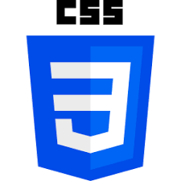

# 🌸 Hi, I'm Vishakha Mokate   


<p align="center">

  

</p>


<p align="center">

  <b>Building RoadToCode 🚀 | SDE I at GetReplies | AWS Community Builder ☁️ | Full-Stack Developer</b>

</p>


---


## 👩🏻‍💻 About Me  


```yaml

name: Vishakha Mokate  

location: Maharashtra, India 🇮🇳

role: B.Sc Computer Science Student

mission: To learn computer skills,build useful projects,and become 
a successful IT professional.


currently:
- Learning HTML
  - Learning CSS
  - Learning JavaScript
  - Practicing Git & GitHub
  - Building Web Projects

goal: Become a Software Develop

```  
## 🛠 Tech Stack  


<p align="left">

  

  

</p>


---


## 📈 GitHub Stats  


[](https://git.io/streak-stats)


---


## 🐍 Contribution Snake  


.svg)

---


## 🌐 Let's Connect  


<p align="left">

  <a href="https://www.linkedin.com/in/vishakha-mokate-a354263b5/">

    


  </a>

</p>


---
  

